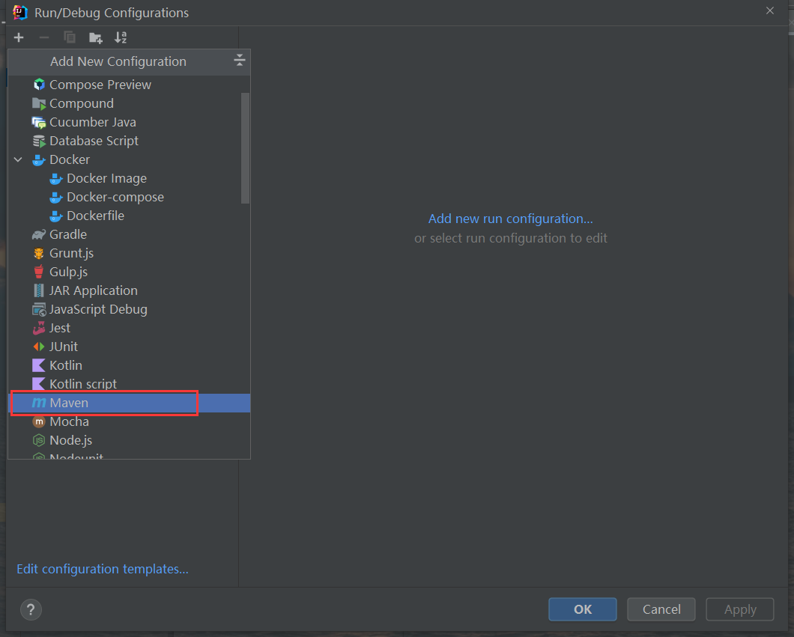
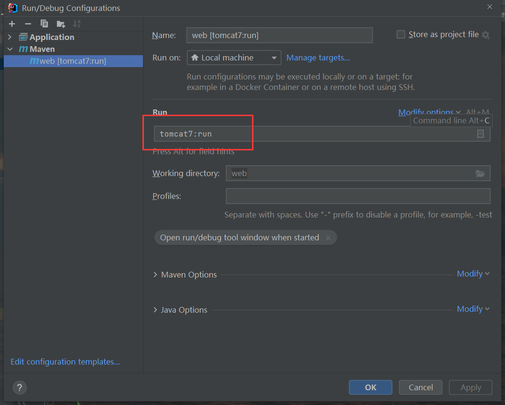
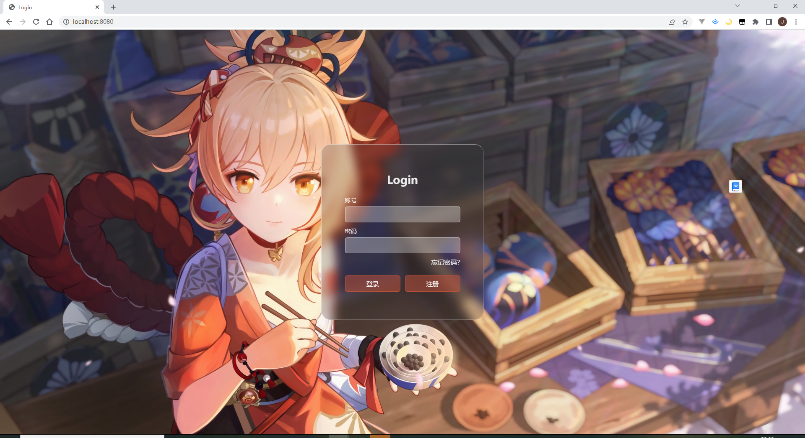

# Java Web实现基本登录页面

## Using Java web technology to realize basic login

## 启动准备

项目启动的`Tomcat`服务器使用的是`Maven`插件，

在启动之前应先配置`Maven`启动项

可以参考下图





# 启动项目
启动命令
```shell
mvn clean tomcat7:run
``` 

# 界面展示


## 技术选型及版本
| 技术     |       版本        |
|--------|:---------------:|
| JDK    |       17        |
| MySQL  |     8.0.12      |
| Maven  |      3.8.6      |
| Tomcat | Tomcat7 Maven插件 |
